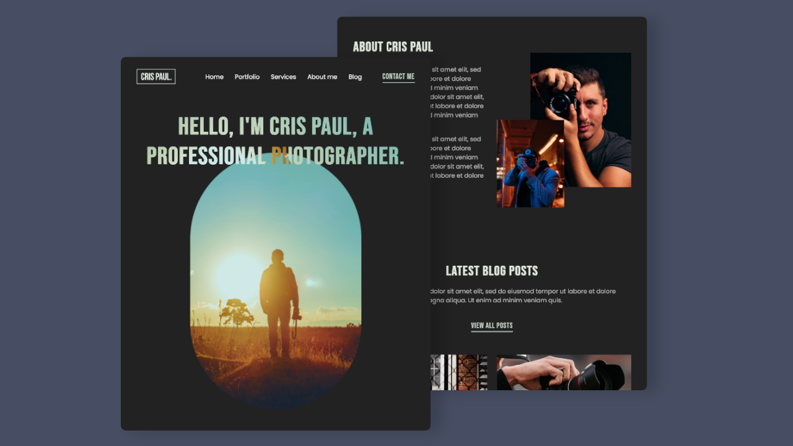

# Starter files
### Create a responsive personal portfolio website using HTML, CSS & JavaScript
##### [Watch the tutorial on YouTube](https://youtu.be/E1ZjV2oVTY0)
- Mobile first responsive design
- Utilize grid to create fluid layouts
- Utilize flexbox to align elements
- Animate elements using JavaScript libraries

